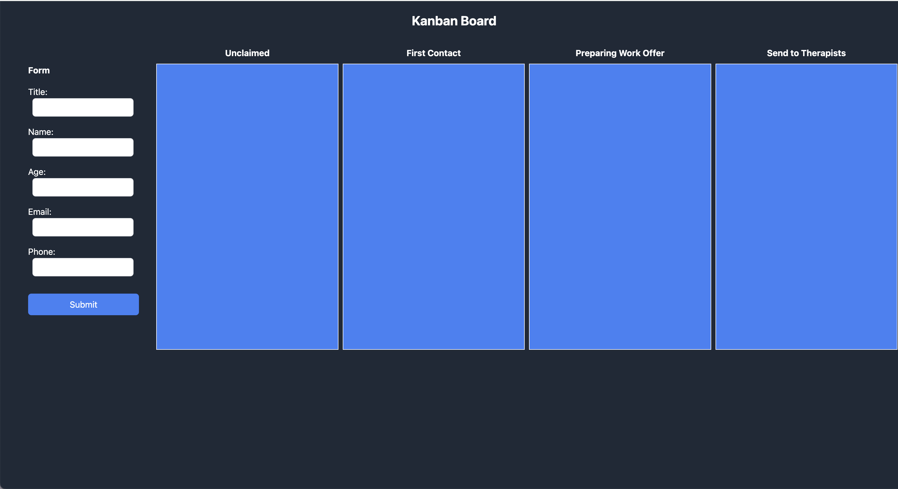
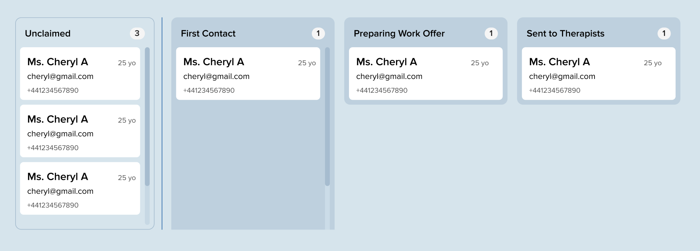

# Kanban Board Bookings

Thank you for taking the time to do this exercise. If you enjoy the exercise and would like to continue, we would be delighted to interview. We will spend the first part of your interview discussing this work.

Please upload your final work on a public repository and include the url inside the email

Note: Git history will be checked so make sure you write meaningful commit messages.

## Brief: Kanban Board Bookings

An online mental health clinic is building a new board to allow its operations team to keep track of new bookings. They have a basic form to enter the member's details onto the board:

- Name
- Title
- Age
- Email
- Mobile Number

The board has 4 columns:

- **Unclaimed**: new cases
- **First Contact**: operations team contact member
- **Preparing Work Offer**: searching for Therapist
- **Send to Therapist**: matched with Therapist

This is what the board currently looks like:

## How to Start

This is a simple create-react-app application, and we are using ReactJS with TypeScript and Tailwind CSS for styling.

## Instructions to run the project:

1. Run npm install to install the necessary dependencies.
2. Run npm run dev to start the development server.
3. Open your browser and navigate to http://localhost:5173.

You are required to use Tailwind CSS for styling throughout the project. Please do not use any other CSS frameworks or libraries like styled-components.

## Tasks

1. **Member Form Validations**

   - Implement form validations for each field (Name, Title, Age, Email, and Mobile Number) to ensure that correct data is entered.
   - Display relevant error and helper messages for invalid or missing inputs.

2. **Create New Member Card**

   - Upon submitting the form, create a new card with the entered details and place it in the _Unclaimed_ column.

3. **CRUD Operations on Member Cards**

   - Implement full CRUD (Create, Read, Update, Delete) functionality for member cards.
     - **Create:** Add new member cards to the board.
     - **Read:** Display the details of each member card.
     - **Update:** Allow editing of card details.
     - **Delete:** Enable the removal of member cards from the board.

4. **Card Status Management**

   - Add functionality to update the status of each card by moving it between different columns (_Unclaimed_, _First Contact_, _Preparing Work Offer_, and _Send to Therapist_).
   - **_BONUS_** Implement drag-and-drop functionality to allow users to easily change the status of a card by dragging it between columns. 

5. **Persistent Data with Local Storage**

   - Save all member card data to _local storage_ so that the board retains the cards even after a page reload.
   - Reload and display previously entered cards from _local storage_ when the page is refreshed.

6. **Column Card Count**

   - Each column should display the number of member cards it contains, updating dynamically as cards are added, deleted, or moved.

7. **Styling**
   - Style the member form, card components, and board using **Tailwind CSS**.
   - Ensure the page has a clean and user-friendly design, with a focus on usability and aesthetics.

## Review Interview

Once we have received your repository we will organize a follow-up interview to discuss your solution.

If you don't have time, that's fine. During the interview, we will discuss strategies that you might have used to achieve these.

The final design of the board should look like this:

